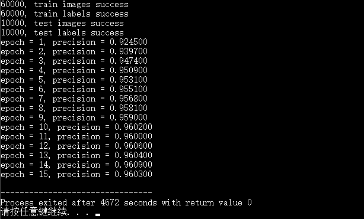

# MNIST-BP-CPP
用 C++ 实现 BP 神经网络识别手写数据集 `MNIST`

## 数据集
$60000$ 训练集，$10000$ 测试集。

每幅图像为 $28*28$ 的灰度图像，单个像素值范围 $0$ 到 $255$ ，作为输入前需要进行 $/=255$ 的归一化处理。每个真实值标签是一个 $0$ 到 $9$ 的整数值，读入后类型转换为 double 型。

## BP 神经网络架构
* $784$ 个输入层单元，$30$ 个隐藏层单元，$10$ 个输出层单元。各层两两之间全连接。
* $w1[i][j]$：第 $i$ 个输入单元到第 $j$ 个隐藏单元的权重
* $bias1[j]$：第 $j$ 个隐藏单元的偏置
* $w2[j][k]$：第 $j$ 个隐藏单元到第 $k$ 个输出单元的权重
* $bias2[k]$：第 $k$ 个输出单元的偏置
* 激活函数：$sigmoid$
* 损失函数：$1/2$ 均方误差
* 训练方法：单图梯度下降

## 运行结果

## 备注
* `MNIST` 数据集请自行下载，并放在与 main.cpp 同一个目录下
* main.cpp 中的梯度计算部分较为复杂，可自行打草稿验证
* 运行程序时若无故出现长时间未响应的情况，可按 Enter 继续。目前出现这种情况的原因未知
* 请忽略一些奇怪的 git 历史提交